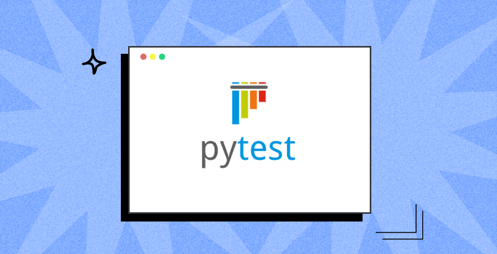

# Pytest Tutorial

- In this particular repository, we will give you a small tutorial of how we can learn Writing Tests using Pytest in a very small period of time.  

- We will cover various topics:
  - Assertion and Test Discovery
  - Skipping and Marking Pytest
  - Command Line Options for Pytests
  - Paramaterizing Pytests
  - Fixtures in Pytests
  - Pytest Customizations
  - BDD using Pytests

- This is going to be a great learning experience overall, so get ready, to start your hands on with testing using Pytest in Python.  
- It would be reall great if the learners have a decent experience, working around with python, would be really helpful.
 